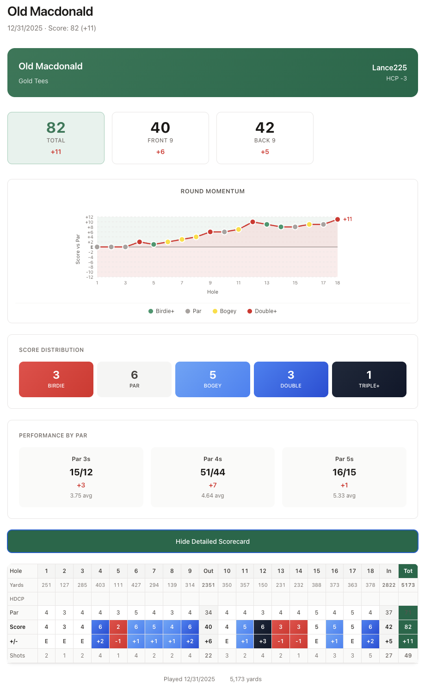
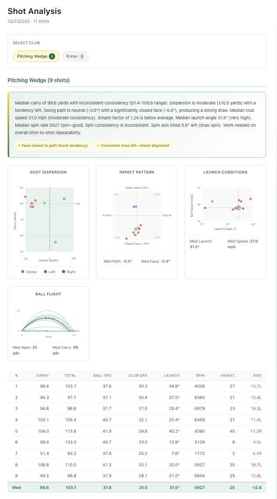

# Golf Data Viz

A web app for visualizing your Trackman golf data with detailed shot analysis, round scorecards, and performance charts.



## Features

- **Round Scorecards** — View hole-by-hole scores with par performance breakdown
- **Momentum Charts** — Track your cumulative score vs par throughout the round
- **Shot Analysis** — Per-club statistics with dispersion, launch, and impact visualizations
- **Natural Language Summaries** — AI-generated insights about your swing tendencies
- **Median-Based Stats** — Robust statistics that aren't skewed by mishits



## Tech Stack

- **React 19** + TypeScript
- **Vite** for fast dev/build
- **SVG Charts** — Custom visualizations (no charting library)
- **Chrome Extension** — Captures Trackman auth tokens automatically

## Project Structure

```
golf/
├── webapp/          # React frontend
│   ├── src/
│   │   ├── api/           # Trackman API client
│   │   ├── components/    # React components
│   │   ├── utils/         # Shot analysis utilities
│   │   └── types/         # TypeScript types
│   └── ...
└── extension/       # Chrome extension for auth capture
```

## Getting Started

### 1. Install the Chrome Extension

Load the `extension/` folder as an unpacked extension:
- Go to `chrome://extensions`
- Enable "Developer mode"
- Click "Load unpacked" and select the `extension` folder
- Copy the extension ID

### 2. Configure the Web App

Create a `.env` file in the `webapp/` directory:

```bash
VITE_EXTENSION_ID=your-extension-id-here
```

### 3. Run the App

```bash
cd webapp
npm install
npm run dev
```

### 4. Connect to Trackman

- Visit [portal.trackmangolf.com](https://portal.trackmangolf.com) and log in
- The extension automatically captures your auth token
- Return to the app — you're connected!

## Screenshots

> To add screenshots, capture them while logged in and save to `docs/screenshots/`:
> - `course-view.png` — Scorecard with momentum chart
> - `shot-analysis.png` — Club selection with visualizations

## License

MIT
